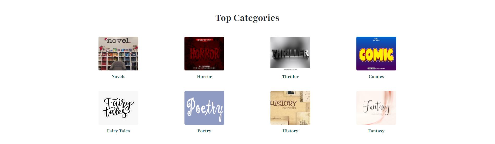
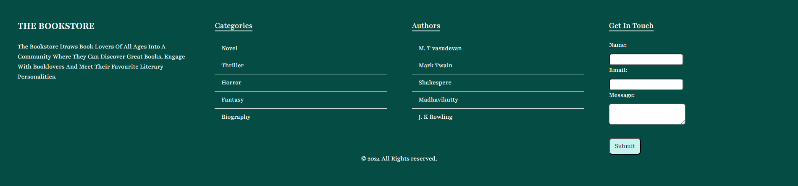
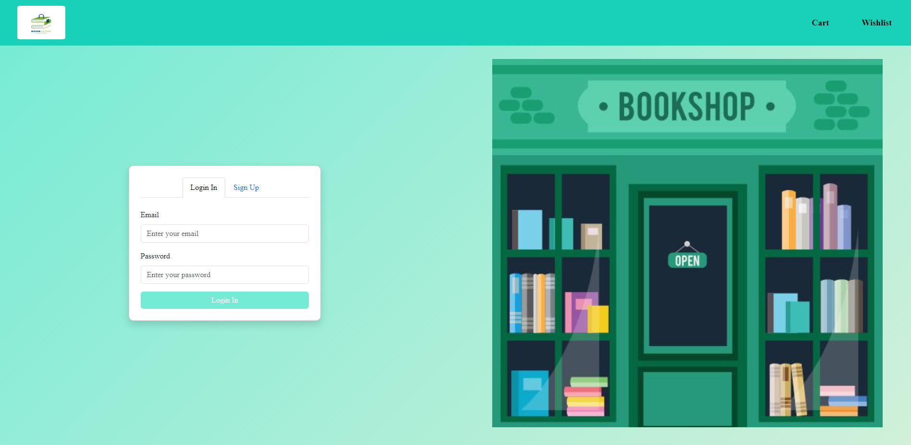
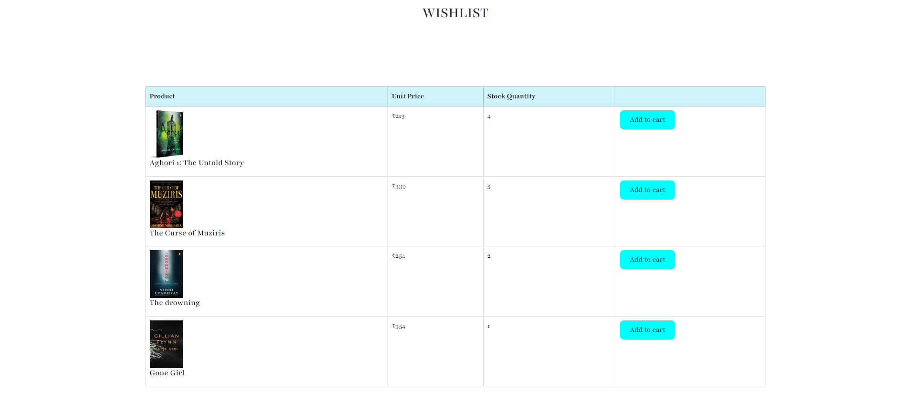
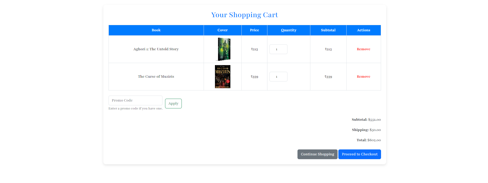
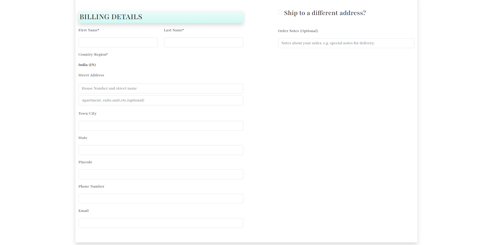

  <h1>📚 Online Book Store</h1>
  
A modern e-commerce platform for book lovers

  
  
  

## 🚀 Technologies

This project is developed with:

- **Bootstrap** - Modern UI framework
- **HTML5** - Structure and content
- **CSS3** - Styling and animations

## 📱 Features

### 🏠 Homepage
Beautiful landing page featuring:
- Categorized book collections
- Dynamic carousel showcase
- Special offers and highlights

🟢
📸 Screenshots

 

### 🔐 Authentication
Secure and user-friendly login system

🟢
📸 Screenshots

 

### ❤️ Wishlist
Keep track of your favorite books

🟢
📸 Screenshots

 

### 🛒 Shopping Cart
Seamless shopping experience

🟢
📸 Screenshots

 

### 💳 Checkout
Streamlined checkout process with:
- Multiple payment options
- Address management
- Order summary

🟢
📸 Screenshots

 

  

---

  
Made with ❤️ for book lovers

  <a href="#top">⬆️ Back to top</a>

