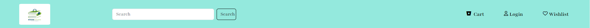

  
<h1>Online Book Store</h1>

  &#xa0;
  
>Bootstrap Based Project
  

 The following tools were used in this project:
- [BOOTSTRAP](https://getbootstrap.com/)
- [HTML](https://developer.mozilla.org/en-US/docs/Web/HTML)
- [CSS](https://developer.mozilla.org/en-US/docs/Web/CSS)

## :checkered_flag: Welcome Page ##
-Card pages have different categories of Books and carousel Slideshow is used to display Discounts ,offers or Highlights

## Login Page

## Wishlist

## Cart Page

## Checkout Page

<a href="#top">Back to top</a>
